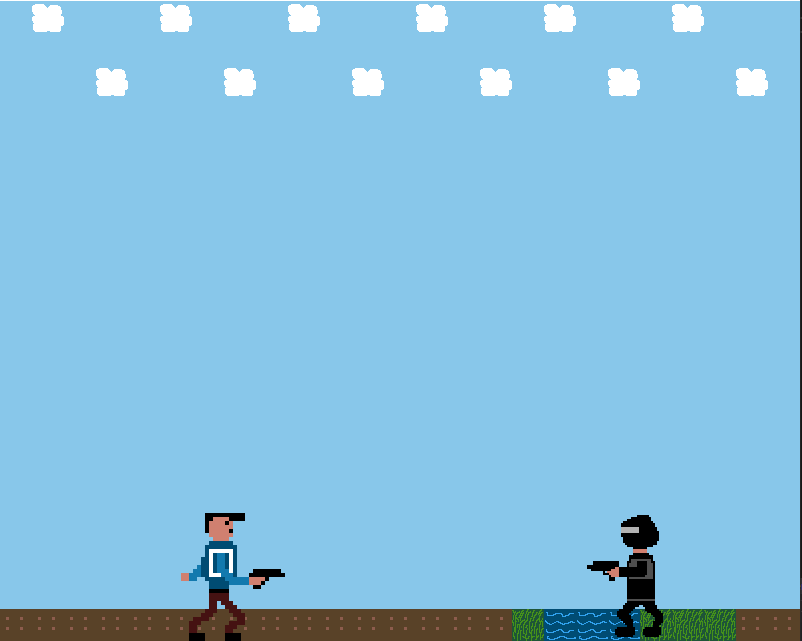

# Entwicklungsblog

## 20.04.2021
In den vergangenen Tagen habe ich über meine Idee für ein Spiel nachgedacht und reifen lassen. Nun bin ich zu der folgenden Idee gekommen: Es soll ein Spiel werden, in dem der Spieler eine Figur mit der Hilfe der WASD Tasten steuern kann. Dabei handelt es sich um eine 2D Umgebung, in der sich der Spieler von links nach rechts bewegen kann. Allerdings gibt es mehrere Ebenen. Das heißt die Figur kann auf eine höhere Ebene springen und auch wieder eine Ebene tiefer fallen. Die Figur hat eine Waffe, welche Projektile abschießen kann. Diese sollten genutzt werden um die computergesteuerten Gegner zu besiegen. Allerdings können die Gegner auch Projektile abfeuern und damit den Spieler treffen wenn er nicht ausweicht. Bei zu vielen Treffern hat der Spieler verloren. Das Ziel des Spielers ist es eine gewisse Ziellinie/-abschnitt zu erreichen. Als besondere Mechanik des Spiels soll es bestimmte Tore geben. Wenn der Spieler durch eines dieser Tore läuft ist er invertiert. Das heißt, wenn er nach links mit A laufen will, läuft er nach rechts. Die eigentliche Mechanik besteht nun darin, dass auch das Schießen "rückwärts" funktioniert. In dem normalen Zustand beginnen die Projektile bei der Waffe des Spielers und enden am Bildschirmrand. Im invertierten Zustand beginnen die Projektile am Bildschirmrand und enden bei der Waffe des Spielers. Durch eine gute Strukturierung des Levels soll der Spieler bestimmte Gegner nur im invertierten Modus besiegen können.

## 02.05.2021
Heute habe ich die allgemeine Main-Loop und den Anfang der Klasse Game implementiert. In der Main-Loop wird im Prinizip nichts anderes gemacht als Funktionen der Game Klasse aufzurufen. Dabei muss vor der Main-Loop die init-Funktion ausgeführt werden, welche SDL initialisiert und ein Window erstellt. In der Main-Loop werden nun, solange game->running True zurückliefert, immer wieder die Funktionen handleEvents(), update() und render() ausgeführt. All diese drei Funktion machen allerdings noch nicht viel. HandleEvents behandelt z.B. nur das Event, welches durch das Schließen der Anwendung ausgelöst wird. Sollte die Anwendung geschlossen werden wird die Main-Loop unterbrochen und die clear Funktion gibt belegten Speicher wieder frei.

## 05.05.2021
Heute habe ich mit der Hilfe von Pixel Edit einen ersten Entwurf eines Spielcharakters entwickelt. Diesen habe ich anschließend versucht in meine Anwendung mit einzubinden. Dazu habe ich die Klasse TextureManager definiert, welche die statische Methode LoadTexture besitzt. Diese soll dazu dienen, dass weitere Texturen in Zukunft schnell und einfach geladen werden können. Um meinen Spieler zu laden habe die soeben genannte Funktion in der init Funktion von Game aufgerufen. Damit die Texture gerendert wird, wird die Funktion renderCopy verwendet. Außerdem habe ich dieser Funktion ein SDL_Rect als "Destination-Rechteck" mitgegeben. Dadurch kann ich in meiner update-Funktion die Postion meiner Figur ändern, sodass sie jetzt immer wieder von links nach rechts durch das Fenster läuft. 

## 10.05.2021
Heute habe ich die Klasse GameObject erstellt. Mit der Hilfe dieser Klasse wird die Logik eines Spielobjektes gebündelt. Dadurch können später viele Objekte einfach erstellt werden und z.B. in einem Vektor abgespeichert werden. Die Klasse gameObject beinhaltet die Funktion update() und render(). Diese beiden Funktionen können dann in der Game Klasse in den jeweiligen Funktionen aufgerufen werden. Sind nun alle Objekte in einem Vektor gespeichert kann man über die Liste iterieren und für alle Objekte die Funktionen ausführen. Dem Konstruktor der Klasse kann man den Path zu der jeweiligen Texture und die Startposition des Objektes mitgeben. Des Weiteren habe ich einen ersten Entwurf einer Tilemap erstellt. 

