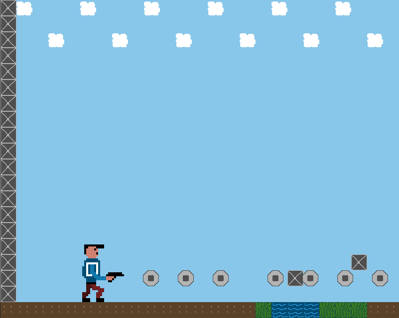

# Entwicklungsblog

## 20.04.2021
In den vergangenen Tagen habe ich über meine Idee für ein Spiel nachgedacht und reifen lassen. Nun bin ich zu der folgenden Idee gekommen: Es soll ein Spiel werden, in dem der Spieler eine Figur mit der Hilfe der WASD Tasten steuern kann. Dabei handelt es sich um eine 2D Umgebung, in der sich der Spieler von links nach rechts bewegen kann. Allerdings gibt es mehrere Ebenen. Das heißt die Figur kann auf eine höhere Ebene springen und auch wieder eine Ebene tiefer fallen. Die Figur hat eine Waffe, welche Projektile abschießen kann. Diese sollten genutzt werden um die computergesteuerten Gegner zu besiegen. Allerdings können die Gegner auch Projektile abfeuern und damit den Spieler treffen wenn er nicht ausweicht. Bei zu vielen Treffern hat der Spieler verloren. Das Ziel des Spielers ist es eine gewisse Ziellinie/-abschnitt zu erreichen. Als besondere Mechanik des Spiels soll es bestimmte Tore geben. Wenn der Spieler durch eines dieser Tore läuft ist er invertiert. Das heißt, wenn er nach links mit A laufen will, läuft er nach rechts. Die eigentliche Mechanik besteht nun darin, dass auch das Schießen "rückwärts" funktioniert. In dem normalen Zustand beginnen die Projektile bei der Waffe des Spielers und enden am Bildschirmrand. Im invertierten Zustand beginnen die Projektile am Bildschirmrand und enden bei der Waffe des Spielers. Durch eine gute Strukturierung des Levels soll der Spieler bestimmte Gegner nur im invertierten Modus besiegen können.

## 02.05.2021
Heute habe ich die allgemeine Main-Loop und den Anfang der Klasse Game implementiert. In der Main-Loop wird im Prinizip nichts anderes gemacht als Funktionen der Game Klasse aufzurufen. Dabei muss vor der Main-Loop die init-Funktion ausgeführt werden, welche SDL initialisiert und ein Window erstellt. In der Main-Loop werden nun, solange game->running True zurückliefert, immer wieder die Funktionen handleEvents(), update() und render() ausgeführt. All diese drei Funktion machen allerdings noch nicht viel. HandleEvents behandelt z.B. nur das Event, welches durch das Schließen der Anwendung ausgelöst wird. Sollte die Anwendung geschlossen werden wird die Main-Loop unterbrochen und die clear Funktion gibt belegten Speicher wieder frei.

## 05.05.2021
Heute habe ich mit der Hilfe von Pixel Edit einen ersten Entwurf eines Spielcharakters entwickelt. Diesen habe ich anschließend versucht in meine Anwendung mit einzubinden. Dazu habe ich die Klasse TextureManager definiert, welche die statische Methode LoadTexture besitzt. Diese soll dazu dienen, dass weitere Texturen in Zukunft schnell und einfach geladen werden können. Um meinen Spieler zu laden habe die soeben genannte Funktion in der init Funktion von Game aufgerufen. Damit die Texture gerendert wird, wird die Funktion renderCopy verwendet. Außerdem habe ich dieser Funktion ein SDL_Rect als "Destination-Rechteck" mitgegeben. Dadurch kann ich in meiner update-Funktion die Postion meiner Figur ändern, sodass sie jetzt immer wieder von links nach rechts durch das Fenster läuft. 

## 10.05.2021
Heute habe ich die Klasse GameObject erstellt. Mit der Hilfe dieser Klasse wird die Logik eines Spielobjektes gebündelt. Dadurch können später viele Objekte einfach erstellt werden und z.B. in einem Vektor abgespeichert werden. Die Klasse gameObject beinhaltet die Funktion update() und render(). Diese beiden Funktionen können dann in der Game Klasse in den jeweiligen Funktionen aufgerufen werden. Sind nun alle Objekte in einem Vektor gespeichert kann man über die Liste iterieren und für alle Objekte die Funktionen ausführen. Dem Konstruktor der Klasse kann man den Path zu der jeweiligen Texture und die Startposition des Objektes mitgeben. Des Weiteren habe ich einen ersten Entwurf einer Tilemap erstellt. 

## 11.05.2021
Am 11.05. habe ich das Entity-Component-System implementiert. Dies soll die GameObjekt Klasse ersetzen, damit Entitys, also Objekte die platziert werden einfacher zu steuern sind und ihnen neue Eigenschaften zugewiesen werden können. Diese Steuerung der Entitys wird durch Components erreicht. Bei der Erstellung der Entitys können den Objekten die gewünschten Komponenten zugewiesen werden. Beispielsweise die TransformComponent. In dieser Komponente wird abgespeichert wo sich die Entity aktuell befindet. Ein weiteres Beispiel ist die SpriteComponent. Diese Komponente speichert die Texture des Objektes ab und sorgt dafür, dass die Texture gerendert wird. Neben der Entity Klasse und den Component Klassen gehört auch der Manager zu dem Entity-Component-System. Die Aufgabe des Managers ist es alle Entitys zu verwalten. Dazu werden alle Entitys in einer Liste gespeichert. In jedem Durchlauf der Mainloop wird in der update-Funktion der Klasse Game überprüft, ob noch alle Entitys in der Liste aktiv sind. Sollte eine Entity nicht mehr aktiv sein wird sie gelöscht. Des Weiteren wird für jede Entity die update Funktion aufgerufen, welche wiederum die update-Funktionen der Components aufruft. Das gleiche passiert jeweils mit der draw Funktion in der gleichnamingen Funktion in der Game Klasse.

## 12.05.2021
Heute habe ich meinen Spielcharakter um die KeyboardComponent Klasse erweitert. In dieser Klasse werden die Inputs der Tastatur in der Form von Events behandelt. Mit der Hilfe der KeyboardCompoent soll man nun die Figur mit der Hilfe von WASD steuern können. Für die Umsetzung muss der TransformComponent eine Geschwindigkeits-/Movementvariable zugewiesen werden. Diese wird in der Update Funktion der Komponente berücksichtigt. In der Keyboard Komponente behandelt man nun die Inputs mit einem switch-case-Statement. Ist der Input z.B. d (nach rechts laufen) wird der Transform Komponente als Movement in x-Richtung eine 1 zugewiesen. Für die anderen Richtungen müssen diese Werte natürlich angepasst werden. Dieses switch-case-Statement muss einmal für ein KEY_DOWN und ein KEY_UP Event durchgeführt werden (mit anderen Aktionen). Das zuvor genannte Beispiel mit d wird zum Beispiel bei einem KEY_DOWN Event (wenn die Taste gedrückt wird) durchgeführt. Bei einem KEY_UP Event (wenn die Taste losgelassen wird) müsste hingegen bei der Eingabe d die Bewegung in x-Richtung wieder auf 0 gesetzt werden, weil der Spieler nicht weiter nach rechts möchte. Zudem muss eine Schwerkraft implementiert werden, damit der Charakter springen kann und nicht irgendwo herumfliegt.

## 20.05.2021
In der vergangenen Woche habe ich mich mit Kollisionen auseinandergesetzt. Natürlich wurde dazu wieder eine Component erstellt. Die CollidersComponent speichert im Prinzip nur die "Hitbox" des Objektes ab. Dafür wird natürlich die Transform Component des Objektes gebraucht. Deshalb wird in der ColliderComponent sichergestellt, dass das Objekt aufjedenfall eine TransformComponent besitzt. Die Collision Klasse benutzt nun diese Collider Components um eine Kollision festzustellen. Momentan wird nur der einfachste Fall einer Kollision überprüft, nämlich die sogenannte AABB Kollision. Bei dieser Art von Kollision wird überprüft, ob die Rechtecke zweier Objekte (A und B) überlappen. Diese Methode funktioniert allerdings nur wenn die Objekte nicht rotiert wurden (was sie im Moment sowieso nicht sind). In der update-Funktion von Game wird nun stetig nach Kollisionen geschaut. Sollte eine Kollision stattfinden, wird der Player zurückgestoßen.

## 21.05.2021
Heute habe ich mich mit den Tiles, also den einzelnen Elementen der Map befasst. Dafür habe ich wieder eine neue Component erstellt. Als Parameter werden dem Konstruktor die x,y Position, die Breite und Länge und die ID des Tiles übergeben. Die ID wird benötigt um das passende Bild zu laden. Die annderen 4 Parameter werden für die Positionierung des Objektes genutzt. In der Init Funktion wird dem Objekt nun zusätzlich eine Transform Component und eine Sprite Component hinzugefügt. Mit der Hilfe des TileComponent habe ich anschließend meine Map Klasse verändert. Nun werden in der loadMap Funktion die Tiles als Entitys erstellt und ihnen wird eine TileComponent zugewiesen. Dadurch werden sie in der Liste von Entities in der Manager Klasse abgespeichert und durch die draw Funktion des Managers automatisch gerendert. Allerdings kann es nun passieren, dass die Player Figur und Enemy Figur nicht mehr gerendert werden, da die Tiles nach den jeweiligen Entities gerendert werden und diese überschreiben. Um sicherzustellen, dass dies nicht passiert habe ich Gruppen entworfen. Im Prinzip wird wird jeder Entity eine Zahl aus einem groupLabel Enum zugwiesen. Zusätzlich wird im Manager eine Gruppenliste gepflegt. Diese Liste speichert Listen von Entities ab. Die Entities in einer Liste gehören entsprechend zu einer Gruppe. Nun werden in der render Funktion der Klasse Game die Gruppen in der Reihenfolge gerendert wie es gewollt ist. In meinem Fall wären das zuerst die Tiles, dann der Player und anschließend die Enemys.

## 26.05.2021
Heute habe ich mich mit Animationen beschäftigt, beziehungsweise mit den Animationen meiner Figur. Dazu habe ich ein Sprite Sheed von meiner Figur entworfen. Darin habe ich verschiedene Bewegungen versucht zu visualisieren (es sieht noch etwas komisch aus). Zum Beispiel habe ich in einer Reihe meine gehende Figur gezeichnet und in einer anderen meine Figur wenn sie steht. Damit es etwas ansprechender aussieht soll meine Figur nämlich ein wenig in die Knie gehen und wieder hoch wenn sie sich nicht bewegt. Außerdem gibt es eine Animation für meine Figur in der Hocke und ein einzelnes Bild für meine Figur beim Springen. Dieses Sprite Sheet habe ich schließlich in meiner Sprite Component mit eingebunden. Dafür habe ich die Klasse Animation erstellt, welche die Zeile im Bild (index), die Anzahl der Frames und die Verzögerung zwischen den Frames abspeichert für die jeweilige Animation abspeichert. Die Klasse nutze ich dann im Konstruktor der Sprite Klasse, welcher bei Sprites mit Animationen aufgerufen wird (überladen). Für die verschiedenen Bewegungen wird jeweils ein Animationsobjekt erstellt und in einer Map abgespeichert. In der Update Funktion wird dann das passende Bild ausgewählt. Der x Wert des source Rechteckes wird mit folgender Formel berechnet: (Ticks in Millisekunden / delay) % frames) * breite. Um nun auch noch die passende Zeile auszuwählen wird der Index der Animation benutzt: höhe * index. Bei Sprites die nicht animiert werden ist der Index standardmäßig 0, sodass sich für diese Sprites nichts ändert. Der Funktion setAnimation kann man nun einen String übergeben, welcher als Key in der Animationsmap dient. Je nachdem welchen String man übergibt wird die entsprechende Animation ausgewählt. Des Weiteren habe ich meinen Keyboard Controller überarbeitet. Ich habe zum Beispiel SDL_RenderFlip benutzt um meine Texturen zu spiegeln. Zuvor habe ich das aufwändiger jeweils mit einem unterschiedlichen Asset erreicht. Außerdem habe ich die Update Funktion etwas refactored damit sie übersichtlicher und leichter zu ändern ist.

## 02.06.2021
In den letzten Tagen habe ich mich mit der Kamera und der Kollision von Tiles beschäftigt. Die Kamera ist dabei ein simples Konzept. Zunächst einmal habe ich generell  festgelegt, dass der Spieler in der Mitte der x-Achse des Bildschirms sein soll. Die Kamera wird im Code nun als SDL_Rect umgesetzt. Sie speichert nun in der update Methode immer wieder die x und y Position der Spielfigur. Von den x Werten wird 400 subtrahiert, weil die Breite des Fensters bei 800 liegt. Damit die Kamera nicht weiter als die Breite der Map läuft, werden diverse if-Abfragen verwendet. So wird zum Beispiel der x Wert auf 0 gesetzt wenn er eigentlich kleiner als 0 ist. Die Kamera machen wir uns dann in der TileComponent zunutze. Dazu zieht man den x und y Wert der Kamera von der Initialen Position des Tiles ab. Außerdem muss in der SpriteComponent mit der aktuellen Position das gleiche gemacht werden. Dadurch erhalten wir eine Tilemap die sich in der gleichen Geschwindigkeit verändert wie sich die Figur bewegt. 
Des Weiteren habe ich mich wie bereits erwähnt mit der Kollision von den Tiles beschäftigt und habe versucht diese in meine Schwerkraft miteinzubinden. Dazu habe ich allen Tiles, die als Tag "Terrain" besitzen einen Collider zugeteilt. Bisher habe ich bei meiner Schwerkraft nur berücksichtigt, ob sich der Spieler auf der Höhe des Bodens befindet. Allerdings soll mein Character später auf einzelne Tiles, welche sich zum Beispiel in der Luft befinden, draufspringen können. Dazu habe ich in einer for-Schleife für jedes Tile (Terrain) überprüft, ob der Character mit dem Tile kollidiert. Sollte dies der Fall sein, wird der KeyboardController benachrichtigt, dass es eine Kollision gab, da sich momentan die Logik der Schwerkraft noch in dieser Component befindet. Auf lange Sicht sollte jedoch vielleicht eine eigene Component erstellt werden. In dem KeyboardController wird bei einer Kollision die Bewegung in y-Richtung gestoppt, sodass in dem Fall, dass die Figur auf einem Tile landet sie dort auch stehen bleibt. Andersherum soll sie herunterfallen, falls plötzlich keine Kollision mehr festgestellt werden kann. Außerdem habe ich den Collider meines Spielers etwas angepasst, damit der Spieler nicht in der Luft hängt, weil sich seine Pistole über einem Tile befindet. Bisher sind noch einige Bugs in meiner Implementierung vorhanden die es noch zu lösen gilt. Zum Beispiel habe ich eine Mauer an den Rändern meiner Map platziert und der Spielcharacter kann diese ohne Probleme hoch fliegen oder der Character bleibt zwischen zwei Tiles hängen da eine AABB Kollision vorliegt, aber der Character eigentlich nicht über dem Tile steht.

## 06.06.2021
Am 6. Juni habe ich mich mit Projektilen beschäftigt. Dazu habe ich natürlich wieder eine Komponente erstellt. An sich ist der Aufbau dieser Komponente sehr simpel. Jedes Projektil besitzt eine Reichweite, Geschwindigkeit und Richtung. In der Update Funktion wird nun die zurückgelegte Distanz in jedem Durchlauf um die Geschwindigkeit erhöht. Anschließend wird überprüft ob die Reichweite überschritten wurde oder ob sich das Projektil außerhalb der Kamera befindet. In beiden Fällen wird die Entity, welchem die ProjectileComponent zugewiesen wurde, zerstört. Um nun Projektile effektiv erstellen zu können habe ich einen AssetManager implementiert. Zunächst einmal besitzt der AssetManager die Methoden addTexture und getTexture mit denen Texturen in eine Map gespeichert bzw. Texturen aus der Map geladen werden können. Dadurch werden alle Texturen in einer Klasse verwaltet. Des Weiteren kann man mit dem AssetManager bestimmte Entitys erstellen. Bis jetzt habe ich nur die Funktion createProjectile implementiert. In dieser Funktion wird eine Entity mit allen Komponenten, die sie als Projektil benötigt, erstellt. Dadurch konnte ich nun die Funktion shoot in meinem Keyboard Controller erstllen. In dem Fall, dass der Spieler K drückt wird von der Position des Spielers ein Projektil abgeschossen. In der Funktion wird außerdem sichergestellt, dass ein gewisses Delay zwischen den Schüssen eingehalten wird. Das Delay, die Reichweite und die Geschwindigkeit des Projektils könnten dann später bei unterschiedlichen Waffentypen angepasst werden. In der Update Funktion der Game Klasse wird desweiteren überprüft, ob die Projektile mit Gegnern kollidieren. In diesem Fall werden die Projektile aktuell nur zerstört. In späteren Versionen könnten die Gegner an dieser Stelle Schaden bekommen. Außerdem habe ich am 6. Juni ein paar Fehler behoben, z.B. in der refresh Methode des Managers. Zuletzt habe ich auch einiges an Dokumentation zu meinem Code hinzugefügt um die Lesbarkeit zu erhöhen.

## 08.06.2021
Heute habe ich versucht die ersten Stats und Waffen in das Spiel mit einzubinden. Dazu habe ich die Komponente Stats implementiert. In dieser Komponente werden bestimmte Werte für eine Entity abgespeichert. Z.B. die Laufgeschwindigkeit, die Geschwindigkeit beim hocken, das maximale Leben sowie das aktuelle Leben. Des Weiteren kann eine Primary und Secondary Waffe abgespeichert werden. Mit der Funktion changeWeapon kann die ausgerüstete Waffe geändert werden. In der draw Methode wird aktuell die Lebensanzeige des Spielers angezeigt. Allerdings kann der Spieler aktuell noch keinen Schaden bekommen, deswegen rotiere ich mit einem Counter und Modulo die verschieden Lebensanzeigen durch. Für die Waffen habe ich eine Klasse Weapon und die Klasse Weapons erstellt. Jede Waffe hat eine Reichweite, Geschwindigkeit, Verzögerung zwischen den Schüssen, Maximale Muntition, aktuelle Patronen in der Waffe, sowie eine Nachladezeit. Die Stat Component mache ich mir dann aktuell vorallem in der KeyboardComponente zunutze. So kann der Spieler zwischen einer Pistole und einer Maschinenpistole wechseln, welche sich durch andere Werte unterscheiden. Außerdem muss der Spieler nun nachladen wenn er keine Munition mehr hat. Allerdings sind noch keine Animationen bei einem Waffenwechsel oder bei einem Reload vorhanden.

